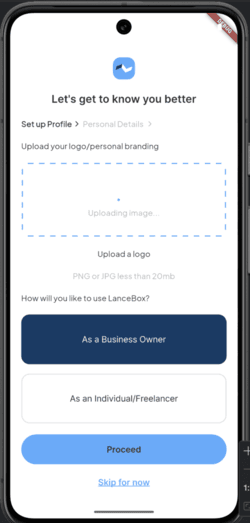
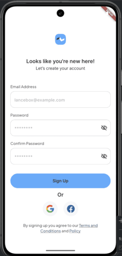

# LanceBox ReadMe

LanceBox is a mobile app project suitable as a sample app for commercial banks. It helps customers view their invoices and onboard themselves as customers of the bank. This comprehensive guide provides everything you need to know to get started with the project, from installation instructions to a detailed description of its features.

## Table of Contents

- [Features](#features)
- [Installation](#installation)
   - [Prerequisites](#prerequisites)
   - [Clone the Repository](#clone-the-repository)
   - [Configuration](#configuration)
   - [Build and Run](#build-and-run)
- [Usage](#usage)
- [Contributing](#contributing)
- [License](#license)

## Features

Key features and functionalities of LanceBox:

- **Sign-Up Screen:** New customers can open accounts using their email and password.
- **Onboarding Screen:** Captures basic details of the customer during account creation.
- **Customer Dashboard:** Provides a comprehensive view for managing different app features.

### Screenshots







## Technologies Used

- **Flutter:** For building the cross-platform mobile application.
- **Dart:** Programming language used in Flutter development.
- **Riverpod:** Used for state management in this project.
- **Architecture:** Built using MVVM architecture.

## Installation

Follow these steps to install and run LanceBox on your system.

### Prerequisites

Before you begin, ensure you have the following dependencies and tools installed:

<a href="https://docs.flutter.dev/get-started/install" target="_blank">Flutter SDK</a>
<a href="https://dart.dev/get-dart" target="_blank">Dart SDK</a>

- An IDE (e.g., Visual Studio Code, Android Studio)

### Clone the Repository

1. Open your terminal or command prompt.
2. Use the following command to clone the LanceBox repository:

```bash
git clone https://github.com/jayhymn/lance_box.git
```

### Configuration

1. Change your working directory to the cloned repository:

```bash
cd lance_box
```

2. Ensure you have the necessary Flutter packages installed:

```bash
flutter pub get
```

3. (Optional) Configure environment variables or API keys if required.

### Build and Run

1. Connect your physical device or start an emulator.
2. To build and run the project, use the following command:

```bash
flutter run
```

This will build the project and install it on your connected device or emulator.

## Usage

1. Upon launching the app, you can create a new account or sign in as an existing user.
2. New users are taken through the onboarding process to fill in their basic details.
3. The dashboard provides access to key features like profile management, settings, and viewing invoices.

## Contributing

Contributions are welcome! Please feel free to submit a pull request or create an issue for feedback and suggestions.

## License

This project is licensed under the MIT License. See the [LICENSE](https://github.com/jayhymn/lance_box/blob/main/LICENSE) file for details.

Thank you for choosing LanceBox! If you encounter any issues or have suggestions for improvements, please don't hesitate to [create an issue](https://github.com/jayhymn/lance_box/issues).

